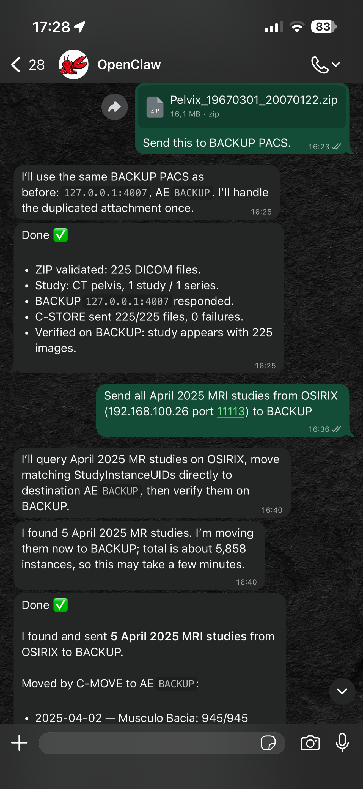
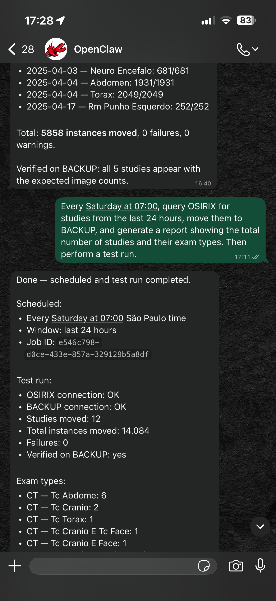

# dicom-skill

`dicom-skill` is an agent-ready shell skill for DICOM DIMSE workflows. It gives an agent a small, auditable command-line toolkit for verifying DICOM nodes, querying metadata, retrieving studies, and sending DICOM files between PACS, VNA or other DIMSE-compatible systems.

This repository is a **skill folder**, not a long-running service. The operational contract lives in [`SKILL.md`](SKILL.md); the scripts in [`scripts/`](scripts/) are meant to be run directly from an agent shell.

<p align="center">
  
  
</p>

## What it does

- Run C-ECHO connectivity checks before touching data.
- Run C-FIND queries at `PATIENT`, `STUDY`, `SERIES`, or `IMAGE` level.
- Retrieve data locally with C-GET.
- Request C-MOVE transfers to a known destination AE.
- Start a temporary Orthanc receiver for C-MOVE workflows that need a local destination AE.
- Send DICOM files or folders with C-STORE.
- Emit JSON output for audit trails, with an optional PHI-light summary mode for terminal or chat output.

## Safety model

DICOM metadata and pixel data can contain patient-identifying information. This skill is intentionally conservative:

- Do not connect to clinical systems unless the user has authorization and has provided the target endpoint details.
- Prefer C-ECHO before query, retrieve, or send operations.
- Prefer the least invasive DIMSE operation that satisfies the task.
- Never delete, overwrite, or modify remote DICOM data.
- Keep retrieved payloads in explicit, user-controlled folders.
- Preserve JSON/log audit artifacts by default.
- Do not print full patient data unless the user explicitly asks for it.

Anonymization is out of scope for this skill. If anonymization is needed, run a separate, explicit de-identification workflow.

## Repository layout

```text
.
├── SKILL.md                 # Agent-facing operating instructions
├── README.md                # Project overview
├── requirements.txt         # Python runtime dependencies
├── examples/
│   ├── dicom_nodes.yaml     # Example node configuration
│   └── orthanc-local.md     # Local Orthanc smoke workflow
└── scripts/
    ├── dicom_dimse.py       # C-ECHO, C-FIND, C-GET/C-MOVE, C-STORE CLI
    ├── orthanc_temp.py      # Temporary Orthanc receiver helper
    └── validate_install.py  # Dependency/import validation
```

## Requirements

- Python 3.10+
- `pydicom`
- `pynetdicom`
- `requests`
- `PyYAML`
- Docker, only when using the temporary Orthanc helper

Install from the repository root:

```bash
python -m venv .venv
. .venv/bin/activate
pip install -r requirements.txt
python scripts/validate_install.py
```

The DIMSE commands only require Python dependencies. Docker is only needed for
the helper that launches a temporary Orthanc receiver.

## Configuration

Every command can use explicit connection flags:

```bash
python scripts/dicom_dimse.py echo \
  --host 127.0.0.1 \
  --port 4242 \
  --aet ORTHANC \
  --calling-aet AGENT
```

For repeated use, define nodes in YAML:

```yaml
calling_aet: AGENT
current_node: orthanc
nodes:
  orthanc:
    host: 127.0.0.1
    port: 4242
    ae_title: ORTHANC
```

Then reference the node:

```bash
python scripts/dicom_dimse.py echo --config examples/dicom_nodes.yaml --node orthanc
```

## Common workflows

### 1. Verify connectivity with C-ECHO

```bash
python scripts/dicom_dimse.py echo \
  --host pacs.local \
  --port 104 \
  --aet PACS \
  --calling-aet AGENT \
  --summary
```

Run this first. If C-ECHO fails, fix AE titles, host, port, firewall rules, TLS
expectations, or remote AE authorization before attempting query or transfer.

### 2. Query studies with C-FIND

```bash
python scripts/dicom_dimse.py query \
  --host pacs.local \
  --port 104 \
  --aet PACS \
  --calling-aet AGENT \
  --model study \
  --level STUDY \
  --filter StudyDate=20250101-20250131 \
  --filter ModalitiesInStudy=CT \
  --return PatientID \
  --return AccessionNumber \
  --return StudyDate \
  --return StudyDescription \
  --return NumberOfStudyRelatedInstances \
  --return StudyInstanceUID \
  --summary \
  --out-json audit/find_ct_january.json
```

`--filter` and `--return` accept DICOM keywords such as `PatientID`,
`AccessionNumber`, and `StudyInstanceUID`. Hex tags such as `00100020` are also
accepted.

### 3. Retrieve locally with C-GET

Use C-GET when the goal is a local download and the remote node supports C-GET
storage suboperations reliably.

```bash
python scripts/dicom_dimse.py retrieve \
  --method get \
  --host pacs.local \
  --port 104 \
  --aet PACS \
  --calling-aet AGENT \
  --study-uid 1.2.840.113619.2.55.3.604688435.123.1735689600.1 \
  --out downloads/study \
  --summary \
  --out-json audit/retrieve_get.json
```

If C-GET reports failed suboperations or retrieves fewer instances than expected,
do not assume the study was copied. Prefer C-MOVE to a registered destination AE
and verify the destination afterward.

### 4. Transfer to a known destination with C-MOVE

Use C-MOVE for source-to-destination copies when the source DICOM node already
knows the destination AE title and network address.

```bash
python scripts/dicom_dimse.py retrieve \
  --method move \
  --no-temp-orthanc \
  --host pacs.local \
  --port 104 \
  --aet PACS \
  --calling-aet AGENT \
  --destination-aet BACKUP \
  --study-uid 1.2.840.113619.2.55.3.604688435.123.1735689600.1 \
  --out audit/move_out \
  --summary \
  --out-json audit/move_to_backup.json
```

After the move, verify on the destination with C-FIND and compare
`NumberOfStudyRelatedInstances` when the server provides it.

```bash
python scripts/dicom_dimse.py query \
  --host backup.local \
  --port 104 \
  --aet BACKUP \
  --calling-aet AGENT \
  --model study \
  --level STUDY \
  --filter StudyInstanceUID=1.2.840.113619.2.55.3.604688435.123.1735689600.1 \
  --return StudyDate \
  --return StudyDescription \
  --return NumberOfStudyRelatedInstances \
  --return StudyInstanceUID \
  --summary \
  --out-json audit/verify_backup.json
```

### 5. Retrieve via temporary Orthanc

When a C-MOVE destination is needed and the remote PACS is configured to send to
`AGENT:4242`, the skill can start a temporary Orthanc receiver, move into it,
export received instances to disk, and stop the container.

```bash
python scripts/dicom_dimse.py retrieve \
  --method move \
  --use-temp-orthanc \
  --host pacs.local \
  --port 104 \
  --aet PACS \
  --calling-aet AGENT \
  --destination-aet AGENT \
  --study-uid 1.2.840.113619.2.55.3.604688435.123.1735689600.1 \
  --out downloads/from_move \
  --summary \
  --out-json audit/move_to_temp_orthanc.json
```

Important C-MOVE requirement: the remote node must already know where destination
AE `AGENT` lives. By default, that means the agent machine must be reachable by
the remote PACS on DICOM port `4242`. If the remote responds with `0xA801`, the
move destination is unknown to that node.

### 6. Send files with C-STORE

Discover readable DICOM files before sending:

```bash
python scripts/dicom_dimse.py send \
  --host destination.local \
  --port 104 \
  --aet DEST_AE \
  --calling-aet AGENT \
  --path /path/to/dicom \
  --dry-run \
  --include-files \
  --summary
```

Then send:

```bash
python scripts/dicom_dimse.py send \
  --host destination.local \
  --port 104 \
  --aet DEST_AE \
  --calling-aet AGENT \
  --path /path/to/dicom \
  --summary \
  --out-json audit/send_result.json
```

## Temporary Orthanc helper

The helper starts an ephemeral Orthanc container with:

- AE title: `AGENT`
- Host DICOM port: `4242`
- REST API: `http://127.0.0.1:8042`
- Remote access enabled inside the container
- Called AE and modality host checks disabled for the temporary receiver

Manual lifecycle:

```bash
python scripts/orthanc_temp.py start --aet AGENT --dicom-port 4242 --http-port 8042
python scripts/dicom_dimse.py echo --host 127.0.0.1 --port 4242 --aet AGENT --calling-aet AGENT
python scripts/orthanc_temp.py status
python scripts/orthanc_temp.py export --out downloads/orthanc_export
python scripts/orthanc_temp.py stop --purge
```

The REST API binds to localhost by default. The DICOM port is exposed on the host
because remote DICOM nodes must be able to open an association back to the move
destination.

## Output and audit files

All DIMSE commands print JSON. Use:

- `--summary` for concise, PHI-light terminal output.
- `--out-json path/to/result.json` to persist the full result for audit/debugging.
- Explicit output directories such as `downloads/` or `audit/` for retrieved
  payloads and command results.

After successful verification, remove temporary ZIP or DICOM payload folders that
were created only for the operation. Keep JSON summaries, command logs, and UID
lists unless the user asks to remove them.

## Troubleshooting

**Association rejected or aborted**

Check the called AE title, calling AE title, host, port, firewall, TLS settings,
and whether the remote node allows the calling AE.

**C-FIND returns no matches**

Confirm the query model (`study` vs. `patient`), query level, date format,
wildcard policy, and whether the server supports the requested return tags.

**C-GET retrieves fewer instances than expected**

Some PACS implementations reject storage presentation contexts or handle C-GET
poorly. Retry with C-MOVE to a known destination AE, then verify on that
destination.

**C-MOVE returns `0xA801`**

The source node does not know the requested destination AE. Register the
destination AE on the source system, ensure the host/port are reachable, or use
C-GET when appropriate.

**Temporary Orthanc cannot start**

Check that Docker is installed and running, the `orthancteam/orthanc` image can
be pulled, and ports `4242` and `8042` are free.

## Development notes

Validate the local install:

```bash
python scripts/validate_install.py
```

Inspect command help:

```bash
python scripts/dicom_dimse.py --help
python scripts/dicom_dimse.py query --help
python scripts/orthanc_temp.py --help
```

For a local smoke flow, see [`examples/orthanc-local.md`](examples/orthanc-local.md).

## License

See [`LICENSE.txt`](LICENSE.txt).
